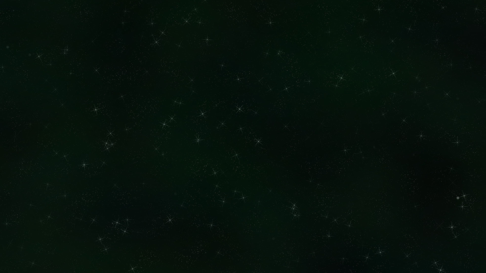
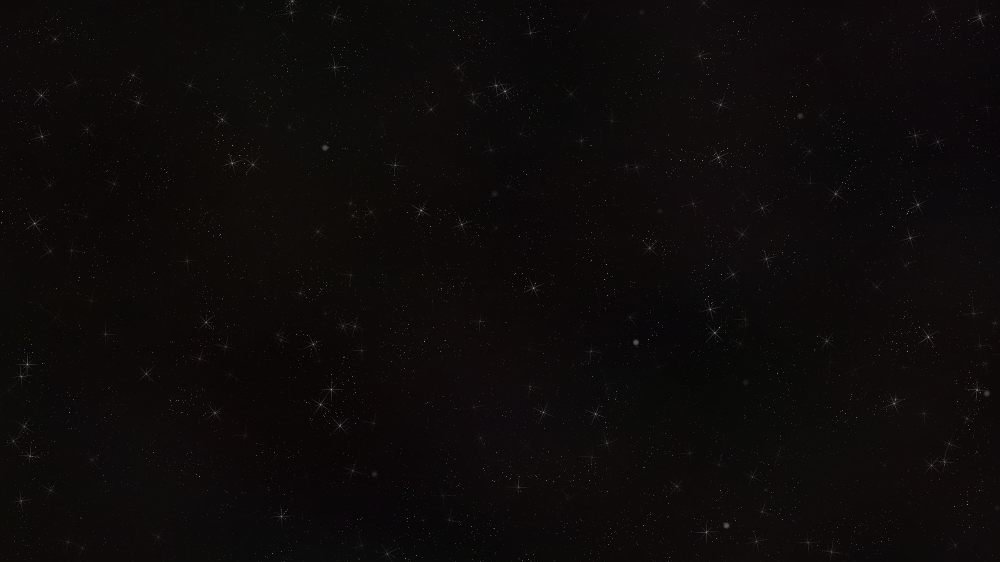
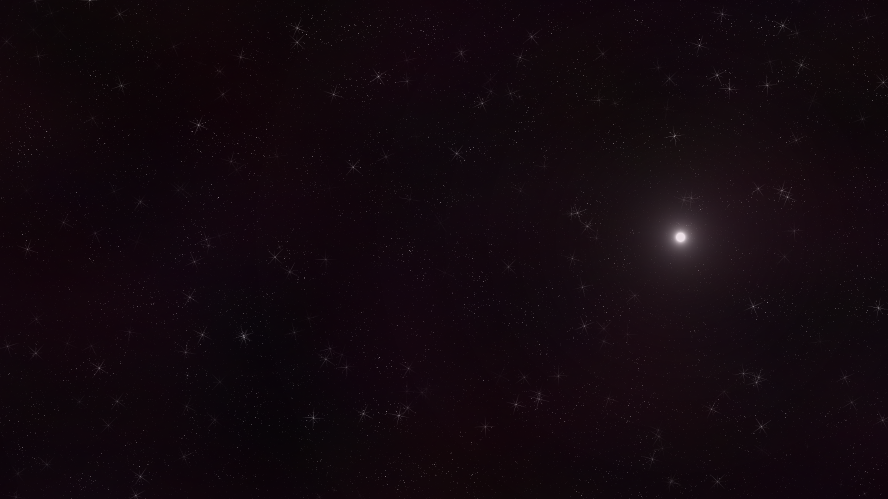

# gimp-space-bg

## What is it?
space-bg is a gimp plugin, which generates space-like images.
It has a number of values to play with and
optionally you can directly export all
of the generated images into a chosen directory as .png files.

## Installation
1. Copy space-bg folder (the one containing space-bg.py) into your GIMP plug-ins directory.
2. Run GIMP.
3. If everything goes well you should find "Space Background..." entry in Filters/Render

## Examples

